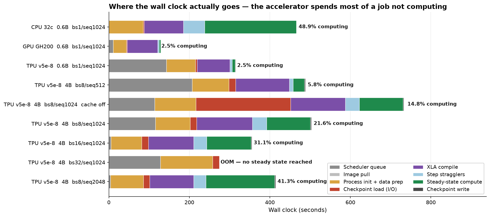
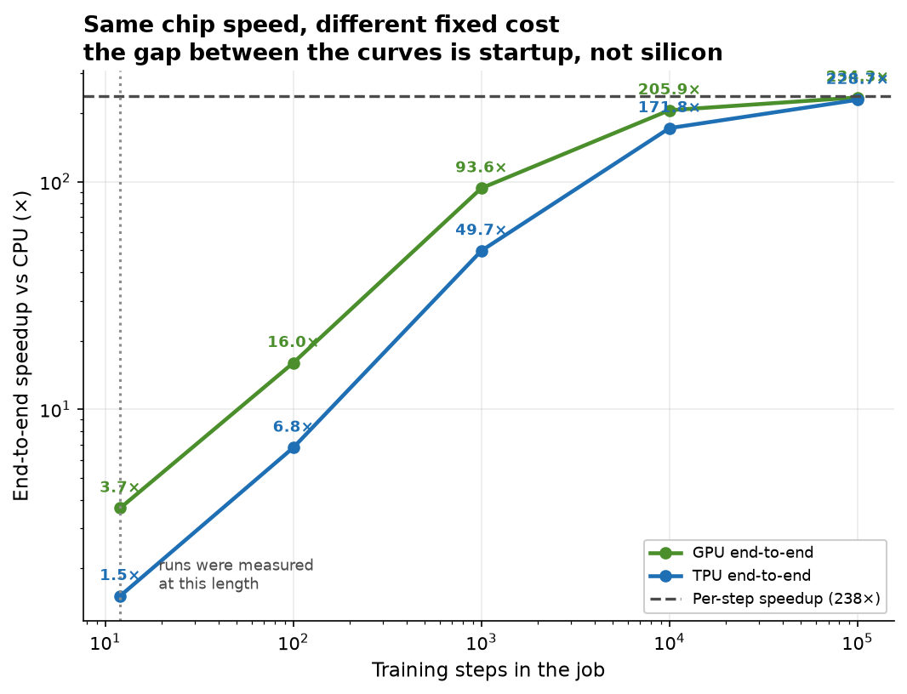
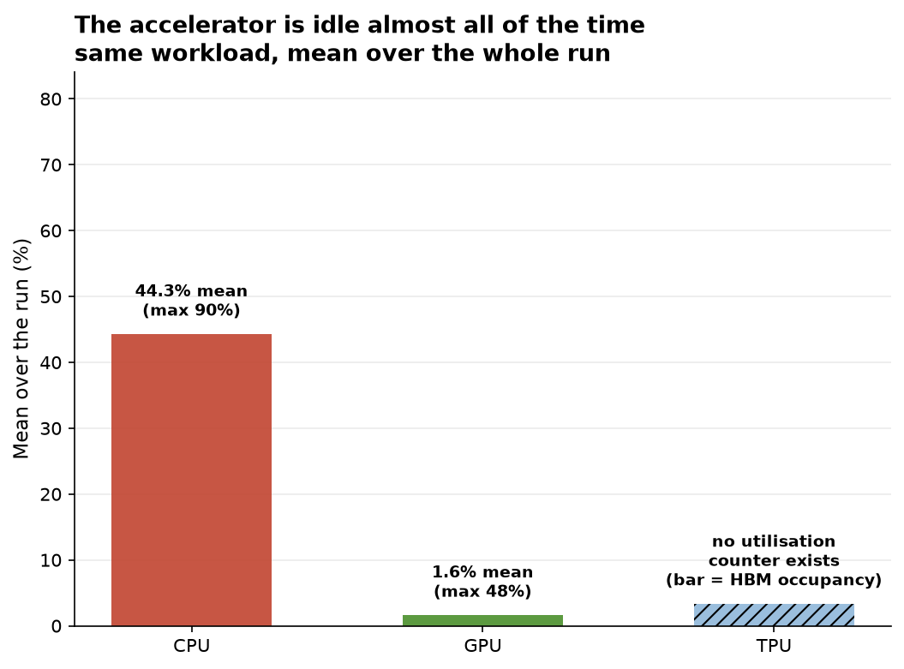

# Fine-tuning an LLM is mostly not the fine-tuning

## 1 — Problem

- **Workload:** LoRA fine-tune of **Qwen3-4B** on **CodiEsp** — Spanish clinical case reports annotated with ICD-10 diagnosis codes, CC-BY 4.0. Training split ~500 documents.
- **Scale:** 66.1 M trainable LoRA parameters at 4B; 20.2 M at 0.6B. `bfloat16`, `remat=DECODER`.
- **The resource challenge:** at **0.6B** all three backends run and the comparison is clean. At **4B** the CPU does not run *at all* — keep remat and XLA's CPU compiler never finishes (>64 min, single-threaded); drop it and the kernel OOM-kills at 31.5 GB against 31 GiB.
- **7× more parameters did not make the CPU 7× slower. It made it impossible.** That discontinuity is the result a speedup chart would hide.
- **Motivation:** a medical billing system that processes clinical documentation is a realistic setting for this class of fine-tune. That is the reason for the dataset — nothing about model quality is claimed or measured here.

> **Where does an LLM fine-tuning workload actually spend its time, and what does it take to run it at all?**

_The object of study is the infrastructure, not the model._

---

## 2 — Proposal & solutions

**One code path, three backends.** JAX traces the program once; XLA lowers it to whichever backend is present. Nothing in `train_qwen3_icd.py` branches on hardware.

| Layer | Choice |
|---|---|
| Compute | TPU v5e 2x4 (8 chips) · 32-core Xeon · GH200 480GB (ARM64) |
| Images | 3 × Docker built (`amd64` TPU, `amd64` CPU, `arm64` CUDA) — the GPU row finally shipped without one |
| Orchestration | GKE `class-tpu-cluster-west4` + **Kueue** LocalQueue `student-queue` |
| Storage | `gs://me344-tpu-labs-west4` → **gcsfuse CSI** sidecar → `/gcs` in the pod |
| CPU plane | bare-metal `podman run`, local disk, no scheduler, no registry |

**The reality check.** Getting one code path onto three backends cost more than writing it. `google-tunix` pulls `libtpu`, which has **no aarch64 wheel** — but exactly **1 of its 36 declared requirements is TPU-bound**, so substituting `jax[cuda12]` is the entire port. Then the on-prem GPU cluster could not authenticate to the Google-hosted registry (**403**). The fix was to delete the registry from the design: public base image + source from a ConfigMap + PyPI/HF/Zenodo.

_We had earlier concluded the cluster had no egress. That test was run **on the node**, not inside the cluster — different networks. One unchecked inference nearly cost us the GPU row._

---

## 3 — Measurements

**A metrics contract, not ad-hoc logging.** One JSON per run. Phases **must** sum to `total_wall_s`; unattributed time goes to `other_s` rather than being dropped. Every number in the report is traced back to a field.

**Wall clock split into 8 segments** — exactly, via an identity that holds for any median `m`:

`sum(steps) = n·m + (S₀−m) + (S₁−m) + Σ(Sᵢ−m)` → compute · first compile · **second compile** · stragglers

Residual after reassembly: ≤ 1.1 × 10⁻¹³ s on all 8 records.

**Sampled:** utilisation at 1 Hz; step times with `median`/`p10`/`p90` after 10 warmup steps; peak HBM from `jax…memory_stats()`, peak RSS on CPU.

**Integrity.** `tokens_per_s` is cross-checked against `batch × seq / median_step`. This exists because an earlier CPU run reported **11 million tokens/s** with `status: "ok"` — a probe blocking on a stale buffer. Its own `notes` caught it; it was discarded and repeated. **A passing status is not sufficient to trust a record.**

---

## 4 — Results

 

| Qwen3-0.6B, bs 1, seq 1024 | CPU 32-core | GPU GH200 (1 chip) | TPU v5e 2x4 (8 chips) |
|---|---|---|---|
| Median step time | 18.9899 s | **0.07979 s** | 0.07997 s |
| Speedup vs CPU | 1.0× | **238.01×** | **237.45×** |
| Wall clock actually computing | 48.9 % | **2.5 %** | **2.5 %** |
| Mean utilisation | 44.3 % | **1.59 %** | *no counter exists* |
| End-to-end at these run lengths | — | **3.68×** | **1.51×** |

**One GH200 matches an 8-chip v5e slice to within 0.23 %** — and finishes the same job **2.44× sooner**, in exactly the ratio of their fixed costs (125.7 s vs 307.1 s). Identical chip speed, different startup cost, different outcome.

4B sweeps: batch 8→16 buys **−1.8 % throughput**; batch 32 **OOMs**. Sequence 512→2048 grows step time as `seq^1.30` with **peak HBM flat** — remat trades capacity for time.

---

## 5 — Conclusion

**Diagnosis — the workload is fixed-cost bound.** Not compute bound: steady-state compute is 21.6 % of the reference run. Not I/O bound any more — we removed that and it stayed 78.4 % non-compute. Not memory-bound for throughput: the batch the HBM ceiling forbids was 1.8 % **slower** per token anyway. **Underutilised — measured:** mean GPU utilisation **1.59 %** over the whole run.

The largest controllable cost is **XLA compilation: 138.5 s against 108.6 s of training.** Two compilations per job on *both* accelerators, 76–138 s across three architectures — near-constant, recomputed every job.

| | | |
|---|---|---|
| **Mitigation applied** | gcsfuse `fileCacheCapacity 0→20Gi`, range reads cached | checkpoint load **14.57× faster**, −31.4 % wall clock, steady step **+0.003 %** |
| **Next** | persistent XLA compile cache (already plumbed, deliberately off) | targets **26–32 % of wall clock** |
| **Cost** | GPU **$0.12**/M tok · TPU **$0.64** · CPU **$5.91** | GPU cheapest across the *entire* published GH200 price range |
| **Scaling** | fixed cost amortises only with run length | TPU 1.5× at 12 steps → 6.8× at 100 → **49.7× at 1000** |

> **Recommendation: fewer, longer jobs — and cache the compilation.** The chip is not the constraint; the job's fixed cost is. Pick the platform for the model that has to fit, not for the batch-1 benchmark — at 4B the v5e is the only one of the three that runs at all.
